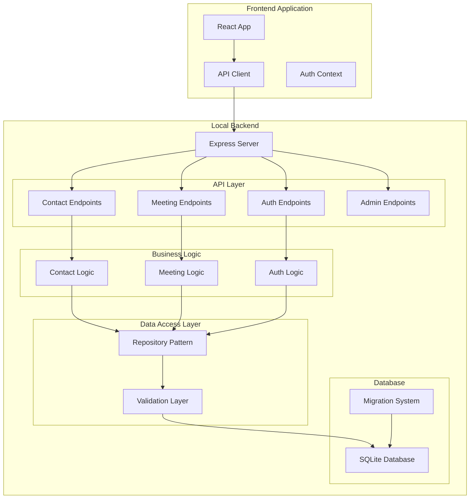

# Design Document: Local Backend Integration

## Overview

This design outlines the transformation of the Base44-dependent application into a standalone React application with a complete local backend. The current application relies on Base44 SDK, serverless functions, and hosted services. This feature will replace all Base44 components with local equivalents, providing a completely self-contained application that can run independently without any external dependencies.

### Core Objectives
1. **Complete Dependency Removal**: Eliminate all Base44 dependencies from the project
2. **Local Backend Implementation**: Create a Node.js/Express server that provides all required functionality
3. **Data Model Preservation**: Convert Base44 entity schemas to local TypeScript/JavaScript models
4. **API Endpoint Migration**: Transform Base44 serverless functions to Express API endpoints
5. **Authentication System**: Implement local JWT-based authentication
6. **Database Management**: Set up SQLite with migration support
7. **Development Workflow**: Create a seamless local development environment
8. **Frontend Integration**: Replace Base44 client with local API client
9. **Monitoring and Logging**: Implement comprehensive observability
10. **Deployment Options**: Support local and cloud deployment

### Key Design Decisions

1. **Backend Technology Stack**: Node.js + Express.js for the server, chosen for its simplicity, extensive ecosystem, and alignment with the existing JavaScript/TypeScript codebase
2. **Database Choice**: SQLite for local development, with PostgreSQL as a production option, selected for its zero-configuration setup and file-based storage
3. **Authentication Approach**: JWT-based authentication with bcrypt password hashing, providing stateless authentication suitable for both local and distributed deployments
4. **API Client Strategy**: Axios-based HTTP client with interceptors for authentication and error handling
5. **Development Environment**: Concurrent execution of backend and frontend with hot reload support

## Architecture

### System Architecture Diagram



### Component Architecture

```
├── Frontend (Existing React App)
│   ├── src/
│   │   ├── api/          # New API client
│   │   ├── lib/          # Utilities, auth context
│   │   └── components/   # UI components
│
├── Backend (New)
│   ├── server/
│   │   ├── src/
│   │   │   ├── index.ts          # Server entry point
│   │   │   ├── config/           # Configuration
│   │   │   ├── middleware/       # Express middleware
│   │   │   ├── routes/           # API routes
│   │   │   ├── controllers/      # Request handlers
│   │   │   ├── services/         # Business logic
│   │   │   ├── repositories/     # Data access
│   │   │   ├── models/           # TypeScript interfaces
│   │   │   ├── validation/       # Input validation
│   │   │   └── utils/            # Utilities
│   │   ├── prisma/               # Database schema & migrations
│   │   ├── package.json          # Backend dependencies
│   │   └── tsconfig.json         # TypeScript config
│
└── Shared
    ├── package.json              # Root package.json (updated)
    ├── docker-compose.yml        # Docker setup
    └── .env.example              # Environment configuration
```

### Data Flow

1. **Frontend Request**: React component calls API client method
2. **API Client**: Adds authentication headers, sends HTTP request to local backend
3. **Express Middleware**: Validates JWT token, parses request body
4. **Route Handler**: Routes request to appropriate controller
5. **Controller**: Validates input, calls service layer
6. **Service**: Implements business logic, calls repository
7. **Repository**: Performs database operations using Prisma
8. **Database**: SQLite performs CRUD operations
9. **Response Flow**: Data flows back through layers to frontend

## Components and Interfaces

### 1. Package Manager Updates
**Component**: `package.json` updater
**Responsibilities**:
- Remove Base44 dependencies (`@base44/sdk`, `@base44/vite-plugin`)
- Add backend dependencies (Express, Prisma, bcrypt, JWT, etc.)
- Update scripts for concurrent execution
**Interface**: 
```json
{
  "scripts": {
    "dev": "concurrently \"npm run dev:backend\" \"npm run dev:frontend\"",
    "dev:backend": "cd server && npm run dev",
    "dev:frontend": "vite"
  }
}
```

### 2. Local Backend Server
**Component**: Express server
**Responsibilities**:
- HTTP server on configurable port (default: 3001)
- CORS configuration for frontend access
- Request logging and error handling
- Static file serving (if needed)
**Interface**: REST API endpoints matching Base44 functions

### 3. Database Layer
**Component**: Prisma ORM with SQLite
**Responsibilities**:
- Database schema definition based on Base44 entities
- Migration generation and application
- Connection pooling and management
- Query optimization
**Interface**: Prisma Client API for type-safe database access

### 4. Authentication System
**Component**: JWT-based auth middleware
**Responsibilities**:
- User registration with password hashing (bcrypt)
- Login with credential validation
- JWT token generation and verification
- Role-based access control
- Session management
**Interface**:
- `POST /api/auth/register` - User registration
- `POST /api/auth/login` - User login
- `POST /api/auth/refresh` - Token refresh
- `GET /api/auth/me` - Current user info

### 5. API Endpoints
**Component**: Express routes and controllers
**Responsibilities**:
- Migrate all Base44 serverless functions to REST endpoints
- Maintain equivalent request/response formats
- Preserve validation and business logic
**Interface**: 
- `POST /api/contact` - Contact form submission
- `POST /api/meeting` - Meeting request submission
- `GET /api/availability` - Availability checking
- `POST /api/meeting/:id/respond` - Meeting response
- `POST /api/visit` - Visit tracking
- `GET /api/admin/data` - Admin data retrieval

### 6. Frontend API Client
**Component**: Axios-based HTTP client
**Responsibilities**:
- Replace Base44 SDK calls with HTTP requests
- Handle authentication token management
- Implement request/response interceptors
- Provide error handling and retry logic
**Interface**: JavaScript/TypeScript functions matching original Base44 client API

### 7. Migration System
**Component**: Database migration runner
**Responsibilities**:
- Generate migration files from schema changes
- Apply migrations in correct order
- Handle migration rollbacks on failure
- Maintain migration history
**Interface**: Prisma migration commands

### 8. Development Environment
**Component**: Concurrent process manager
**Responsibilities**:
- Start backend and frontend simultaneously
- Handle process management and restart
- Provide unified logging
- Support hot reload for both layers
**Interface**: npm scripts using `concurrently`

## Data Models

### Entity Conversion Strategy

Base44 entity schemas will be converted to Prisma schema format with TypeScript interfaces for type safety.

#### 1. ContactMessage Model
**Base44 Schema**:
```json
{
  "full_name": "string",
  "email": "string",
  "message": "string",
  "visitor_ip": "string",
  "browser": "string",
  "country": "string",
  "status": "enum['new', 'read', 'archived']"
}
```

**Prisma Schema**:
```prisma
model ContactMessage {
  id           String   @id @default(cuid())
  full_name    String
  email        String
  message      String
  visitor_ip   String?
  browser      String?
  country      String?
  status       String   @default("new")
  created_date DateTime @default(now())
  updated_date DateTime @updatedAt
  
  @@index([email])
  @@index([status])
  @@index([created_date])
}
```

**TypeScript Interface**:
```typescript
interface ContactMessage {
  id: string;
  full_name: string;
  email: string;
  message: string;
  visitor_ip?: string;
  browser?: string;
  country?: string;
  status: 'new' | 'read' | 'archived';
  created_date: Date;
  updated_date: Date;
}
```

#### 2. MeetingRequest Model
**Base44 Schema**:
```json
{
  "name": "string",
  "email": "string",
  "date": "string",
  "time": "string",
  "topic": "string",
  "status": "enum['pending', 'confirmed', 'cancelled']"
}
```

**Prisma Schema**:
```prisma
model MeetingRequest {
  id           String   @id @default(cuid())
  name         String
  email        String
  date         String
  time         String
  topic        String
  status       String   @default("pending")
  created_date DateTime @default(now())
  updated_date DateTime @updatedAt
  responded_at DateTime?
  
  @@index([email])
  @@index([status])
  @@index([date])
}
```

#### 3. User Model
**Prisma Schema**:
```prisma
model User {
  id           String   @id @default(cuid())
  email        String   @unique
  password     String   // Hashed with bcrypt
  name         String?
  role         String   @default("user") // 'user', 'admin'
  created_date DateTime @default(now())
  updated_date DateTime @updatedAt
  last_login   DateTime?
  
  @@index([email])
  @@index([role])
}
```

#### 4. Visitor Model
**Prisma Schema**:
```prisma
model Visitor {
  id           String   @id @default(cuid())
  ip_address   String
  user_agent   String?
  country      String?
  page_visited String?
  visit_date   DateTime @default(now())
  
  @@index([ip_address])
  @@index([visit_date])
}
```

### Database Relationships

```
User
  ↑
  | (one-to-many)
MeetingRequest -- (belongs to) --> User
ContactMessage -- (optional foreign key) --> User
```

### Validation Layer

All models will have Zod validation schemas for input validation:

```typescript
import { z } from 'zod';

const ContactMessageSchema = z.object({
  full_name: z.string().min(1, "Name is required").max(100),
  email: z.string().email("Invalid email address"),
  message: z.string().min(1, "Message is required").max(1000),
  visitor_ip: z.string().optional(),
  browser: z.string().optional(),
  country: z.string().optional(),
  status: z.enum(['new', 'read', 'archived']).default('new')
});
```

## Testing Strategy

### Why Property-Based Testing is NOT Appropriate

This feature involves infrastructure transformation, dependency removal, and system integration rather than pure functional logic. The acceptance criteria focus on:

1. **Configuration and Setup**: Package.json updates, environment configuration
2. **System Integration**: Connecting frontend to backend, database setup
3. **API Compatibility**: Maintaining equivalent request/response formats
4. **Authentication Implementation**: JWT token generation and validation

Property-based testing is not suitable because:
- Most operations are one-time setup or configuration
- Input variation doesn't meaningfully affect behavior (setup either works or doesn't)
- High cost of running 100+ iterations for infrastructure operations
- Testing focuses on integration rather than algorithmic correctness

### Testing Approach

#### 1. Unit Tests
**Scope**: Individual functions, services, utilities
**Framework**: Jest with TypeScript support
**Coverage**:
- Validation logic (Zod schemas)
- Business logic services
- Utility functions (password hashing, JWT generation)
- Repository layer methods

**Example Test**:
```typescript
describe('ContactService', () => {
  it('should validate and create contact message', async () => {
    const service = new ContactService(mockRepository);
    const contactData = {
      full_name: 'John Doe',
      email: 'john@example.com',
      message: 'Test message'
    };
    
    const result = await service.createContact(contactData);
    expect(result.success).toBe(true);
    expect(mockRepository.create).toHaveBeenCalledWith(
      expect.objectContaining(contactData)
    );
  });
});
```

#### 2. Integration Tests
**Scope**: API endpoints with database integration
**Framework**: Supertest with Jest
**Coverage**:
- HTTP endpoints with request/response validation
- Database operations with test database
- Authentication flow
- Error handling scenarios

**Example Test**:
```typescript
describe('Contact API', () => {
  it('POST /api/contact should create contact message', async () => {
    const response = await request(app)
      .post('/api/contact')
      .send({
        full_name: 'John Doe',
        email: 'john@example.com',
        message: 'Test message'
      });
    
    expect(response.status).toBe(200);
    expect(response.body.success).toBe(true);
    expect(response.body.id).toBeDefined();
  });
});
```

#### 3. End-to-End Tests
**Scope**: Critical user workflows
**Framework**: Playwright or Cypress
**Coverage**:
- User registration and login
- Contact form submission
- Meeting scheduling
- Admin dashboard access

#### 4. Migration Tests
**Scope**: Database schema migrations
**Framework**: Custom test runner
**Coverage**:
- Migration application and rollback
- Data preservation during migrations
- Schema consistency checks

### Test Configuration

```json
{
  "jest": {
    "preset": "ts-jest",
    "testEnvironment": "node",
    "testMatch": ["**/__tests__/**/*.test.ts"],
    "setupFilesAfterEnv": ["./test/setup.ts"],
    "coveragePathIgnorePatterns": [
      "/node_modules/",
      "/dist/",
      "/test/"
    ]
  }
}
```

### Test Execution Strategy

1. **Pre-commit**: Run unit tests and linting
2. **CI Pipeline**: Run all tests (unit, integration, e2e) on pull requests
3. **Pre-deployment**: Run migration tests and integration tests
4. **Post-deployment**: Smoke tests to verify deployment success

### Mock Strategy

- **Database**: Use Prisma's built-in mocking capabilities or in-memory SQLite
- **External Services**: Use Jest mocks for email sending, file uploads, etc.
- **Authentication**: Mock JWT verification for testing protected routes

## Error Handling

### Error Classification

#### 1. Client Errors (4xx)
- **400 Bad Request**: Invalid input, validation errors
- **401 Unauthorized**: Missing or invalid authentication
- **403 Forbidden**: Insufficient permissions
- **404 Not Found**: Resource doesn't exist
- **429 Too Many Requests**: Rate limiting

#### 2. Server Errors (5xx)
- **500 Internal Server Error**: Unexpected server errors
- **503 Service Unavailable**: Database unavailable, maintenance

#### 3. Business Logic Errors
- **Validation Errors**: Input doesn't meet business rules
- **Conflict Errors**: Resource already exists, conflicting state
- **Rate Limit Errors**: Too many requests from same source

### Error Response Format

```typescript
interface ErrorResponse {
  error: {
    code: string;      // Machine-readable error code
    message: string;   // Human-readable message
    details?: any;     // Additional error details
    timestamp: string; // ISO timestamp
    path?: string;     // Request path
  };
}
```

**Example**:
```json
{
  "error": {
    "code": "VALIDATION_ERROR",
    "message": "Invalid email address",
    "details": {
      "field": "email",
      "rule": "must be valid email"
    },
    "timestamp": "2024-01-15T10:30:00Z",
    "path": "/api/contact"
  }
}
```

### Global Error Handling

**Express Error Middleware**:
```typescript
app.use((err: Error, req: Request, res: Response, next: NextFunction) => {
  console.error('Unhandled error:', err);
  
  if (err instanceof ValidationError) {
    return res.status(400).json({
      error: {
        code: 'VALIDATION_ERROR',
        message: 'Validation failed',
        details: err.details,
        timestamp: new Date().toISOString(),
        path: req.path
      }
    });
  }
  
  if (err instanceof AuthenticationError) {
    return res.status(401).json({
      error: {
        code: 'AUTHENTICATION_ERROR',
        message: 'Authentication required',
        timestamp: new Date().toISOString(),
        path: req.path
      }
    });
  }
  
  // Default error
  return res.status(500).json({
    error: {
      code: 'INTERNAL_SERVER_ERROR',
      message: 'An unexpected error occurred',
      timestamp: new Date().toISOString(),
      path: req.path
    }
  });
});
```

### Logging Strategy

#### 1. Request Logging
- Log all incoming requests with method, path, status, response time
- Include user ID for authenticated requests
- Mask sensitive data (passwords, tokens)

#### 2. Error Logging
- Log stack traces for server errors
- Include request context for debugging
- Categorize errors by severity

#### 3. Performance Logging
- Track database query performance
- Monitor memory usage and CPU
- Alert on slow endpoints

#### 4. Security Logging
- Log authentication attempts
- Track permission failures
- Monitor rate limit violations

### Monitoring and Alerting

1. **Health Checks**: `/health` endpoint for service monitoring
2. **Metrics**: Prometheus metrics for performance monitoring
3. **Alerts**: Configure alerts for error rates, response times, resource usage
4. **Dashboard**: Grafana dashboard for real-time monitoring

## Implementation Phases

### Phase 1: Foundation Setup (Week 1)
1. Update package.json to remove Base44 dependencies
2. Create backend directory structure
3. Set up Express server with basic routing
4. Configure TypeScript and build process
5. Implement basic error handling and logging

### Phase 2: Database Layer (Week 2)
1. Convert Base44 entity schemas to Prisma schema
2. Set up SQLite database with Prisma
3. Create migration system
4. Implement repository pattern for data access
5. Add database connection pooling

### Phase 3: Authentication System (Week 3)
1. Implement user model and registration
2. Create JWT-based authentication middleware
3. Add password hashing with bcrypt
4. Implement role-based access control
5. Create auth API endpoints

### Phase 4: API Migration (Week 4)
1. Migrate `submitContact` function to Express endpoint
2. Migrate `submitMeeting` function to Express endpoint
3. Migrate `getAvailability` function to Express endpoint
4. Migrate `respondMeeting` function to Express endpoint
5. Migrate `trackVisit` function to Express endpoint
6. Migrate `getAdminData` function to Express endpoint

### Phase 5: Frontend Integration (Week 5)
1. Create new API client to replace Base44 SDK
2. Update frontend components to use new API client
3. Implement authentication context for React
4. Add error handling and loading states
5. Test end-to-end workflows

### Phase 6: Development Environment (Week 6)
1. Set up concurrent development server
2. Implement hot reload for backend
3. Create development utilities and scripts
4. Add debugging configuration
5. Document development workflow

### Phase 7: Testing and Quality (Week 7)
1. Write unit tests for core functionality
2. Create integration tests for API endpoints
3. Implement end-to-end tests for critical flows
4. Set up CI/CD pipeline
5. Add code quality checks

### Phase 8: Deployment and Documentation (Week 8)
1. Create Docker configuration
2. Document deployment process
3. Write migration guide from Base44
4. Create troubleshooting documentation
5. Final testing and validation

## Dependencies and Constraints

### Technical Dependencies
1. **Node.js**: v18+ required for backend
2. **Express.js**: Web framework for backend API
3. **Prisma**: ORM for database access
4. **SQLite**: Local development database
5. **PostgreSQL**: Production database option
6. **JWT**: Authentication tokens
7. **bcrypt**: Password hashing
8. **Zod**: Input validation
9. **Axios**: HTTP client for frontend
10. **Concurrently**: Process management for development

### Non-Functional Requirements
1. **Performance**: API response time < 200ms for 95% of requests
2. **Availability**: 99.9% uptime for production deployment
3. **Security**: All passwords hashed, JWT tokens signed, input validation
4. **Scalability**: Support horizontal scaling with load balancing
5. **Maintainability**: Clean code, comprehensive tests, good documentation
6. **Portability**: Run on Linux, macOS, Windows, and containerized environments

### Constraints
1. **Backward Compatibility**: API must maintain compatibility with existing frontend
2. **Data Migration**: Existing data must be preserved during transition
3. **Development Experience**: Must provide smooth local development workflow
4. **Deployment Flexibility**: Support both local and cloud deployment
5. **License Compliance**: All dependencies must have compatible licenses

## Risk Assessment and Mitigation

### Technical Risks
1. **Database Compatibility Risk**: Base44 entities may have features not supported by Prisma/SQLite
   - **Mitigation**: Test migration with sample data, implement custom resolvers if needed
   
2. **API Compatibility Risk**: Express endpoints may not exactly match Base44 behavior
   - **Mitigation**: Comprehensive integration testing, implement compatibility layer if needed
   
3. **Authentication Migration Risk**: Users may need to re-register
   - **Mitigation**: Provide migration tool for existing user data, support both auth systems during transition

### Operational Risks
1. **Development Complexity Risk**: Local setup may be complex for new developers
   - **Mitigation**: Comprehensive documentation, automated setup scripts, Docker support
   
2. **Deployment Risk**: Production deployment may have unexpected issues
   - **Mitigation**: Staged rollout, feature flags, rollback plan

### Business Risks
1. **Migration Timeline Risk**: Project may take longer than estimated
   - **Mitigation**: Phased implementation, early delivery of core functionality, regular progress reviews

## Success Metrics

### Technical Metrics
1. **Dependency Removal**: 100% removal of Base44 dependencies
2. **API Compatibility**: 100% of Base44 functions successfully migrated
3. **Performance**: API response times meet or exceed Base44 performance
4. **Test Coverage**: >80% code coverage for critical paths
5. **Error Rate**: <1% error rate for production traffic

### User Experience Metrics
1. **Development Setup Time**: <15 minutes for new developers
2. **API Response Time**: <200ms for 95% of requests
3. **Authentication Success Rate**: >99% successful logins
4. **Data Integrity**: 100% data preservation during migration

### Operational Metrics
1. **Uptime**: 99.9% availability in production
2. **Deployment Success Rate**: >95% successful deployments
3. **Mean Time to Recovery**: <30 minutes for critical issues
4. **Resource Usage**: CPU <70%, memory <80% under normal load

## Conclusion

This design provides a comprehensive roadmap for transforming the Base44-dependent application into a standalone system with a complete local backend. The approach focuses on incremental migration, maintaining compatibility, and ensuring a smooth development experience. By following this design, the application will gain independence from external services while preserving all existing functionality and data.

The implementation will proceed in phases, with each phase delivering usable functionality. Testing will focus on integration and end-to-end workflows rather than property-based testing, which is not appropriate for this infrastructure-focused feature.